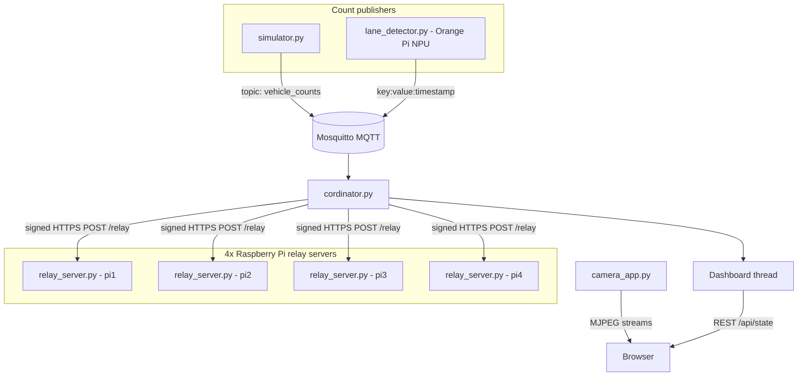

# Smart Traffic Light — Architecture & Overview

This document describes the full **smart-traffic-light** system: purpose, components, data flows, configuration, and deployment. The production stack lives under `src/`; the `vehicle/` folder is a separate computer-vision prototype.

---

## Table of contents

1. [Purpose](#purpose)
2. [High-level architecture](#high-level-architecture)
3. [Intersection model](#intersection-model)
4. [Coordinator](#coordinator)
5. [Relay layer](#relay-layer)
6. [Operator dashboard](#operator-dashboard)
7. [Camera streaming](#camera-streaming)
8. [MQTT messaging](#mqtt-messaging)
9. [Vehicle CV](#vehicle-cv)
10. [Configuration](#configuration)
11. [Typical deployment](#typical-deployment)
12. [Project layout](#project-layout)
13. [Gaps and notes](#gaps-and-notes)

---

## Purpose

A **distributed adaptive traffic-light system** for a school-area intersection (configured for production sites such as DISON). The system:

1. Receives **vehicle and pedestrian counts** over **MQTT**
2. Runs a **coordinator** that selects traffic phases and drives **physical relays** on Raspberry Pis
3. Exposes an **operator dashboard** (live lamp state, manual control, geofenced lane status)
4. Optionally streams **RTSP cameras** to the browser and records segments to disk

Production edge counts come from **`src/lane_detector.py`** (YOLOv8 or RKNN on an Orange Pi NPU), which publishes MQTT. A separate **`vehicle/`** directory is an offline YOLOv8 + SORT prototype and does **not** publish MQTT.

Install, CLI, and a full config reference: **[`README.md`](README.md)** (MIT licensed).

---

## High-level architecture



| Layer | Primary files | Role |
|-------|---------------|------|
| Config | `src/config.py` | Single source of truth: MQTT, phases, relays, cameras, timing |
| Coordinator | `src/cordinator.py` | Phase logic, MQTT subscriber, relay HTTP client, dashboard thread |
| Relay servers | `src/relay_server.py` (×4 Pis) | GPIO control, signature verification |
| Dashboard | `src/dashboard.py`, `src/static/` | Operator UI and public live view |
| Cameras | `src/camera_app.py`, `src/camera_retention.py` | RTSP → MJPEG, optional recording |
| Testing | `src/simulator.py` | Synthetic MQTT counts |
| Edge CV | `src/lane_detector.py`, `src/rknn_detector.py` | Live counts → MQTT (`.pt` or `.rknn`) |
| ANPR | `src/plate_reader.py` | Plates only — no MQTT |
| CV prototype | `vehicle/main.py` | Offline detection (not in production path) |
| Mobile | `trafficator-app/` | GPS lane + `/api/state` |

**Central configuration:** `src/config.py` — shared by coordinator, simulator, dashboard, relay servers, and camera app.

---

## Intersection model

From comments in `cordinator.py` and phase definitions in `config.py`:

- **Two intersection clusters** with poles `pole_1` through `pole_5`, plus a **pedestrian** signal (red/green only, no yellow)
- **Three vehicle sequences** (`seq1`, `seq2`, `seq3`), each with distinct green/yellow/red lamp key lists
- A **narrow centre** zone: the coordinator blocks starting a new phase while `narrow_centre_vehicle_count > 0`, and waits for clearance after each phase

### Schematic (logical)

```text
  a <-> b <-> c     (seq3 from a, seq2 from c)
          |
          |
  d <-> e <-> f     (seq1 from f)
```

### Phases and triggers

| Phase | Name (config) | MQTT trigger keys | Typical cameras (`sequence` in `CAMERA_FEEDS`) |
|-------|---------------|-------------------|------------------------------------------------|
| **seq1** | SEQUENCE 1 | `south_left_vehicle_count`, `south_right_vehicle_count` | `south_left`, `south_right` |
| **seq2** | SEQUENCE 2 | `north_right_vehicle_count` | `north_right` |
| **seq3** | SEQUENCE 3 | `north_left_vehicle_count` | `north_left` |
| — | (blocking) | `narrow_centre_vehicle_count` | `narrow_centre_1`, `narrow_centre_2` |
| — | (pedestrian) | `pedestrian_narrow_passage_count` | Independent of sequences |

Each phase also defines a **geofence** (four lat/lon points) used by the lane-status UI so mobile clients can show which lane/sequence applies to the user’s GPS position.

### Traffic light units

`TRAFFIC_LIGHT_UNITS` in `config.py` lists physical heads (e.g. `pole_1_left`, `pole_4_right_a`). Each unit has at most one of red/yellow/green active. Lamp IDs like `pole_1_left_green` map through `RELAY_MAPPINGS` to `(relay_server, relay_id)`.

---

## Coordinator

**File:** `src/cordinator.py` (note: filename uses “cordinator”, not “coordinator”)

**Role:** Central brain — subscribes to MQTT, selects and runs phases, sends signed relay commands, hosts the dashboard in a background thread.

### MQTT input

- **Topic:** `vehicle_counts` (`config.MQTT_TOPIC`)
- **Payload format:** `key:value:unix_timestamp` (separator and part count from `config.MQTT_PAYLOAD_SEP` / `MQTT_PAYLOAD_PARTS`)

**In-memory keys** (must match publishers):

| Key | Purpose |
|-----|---------|
| `north_right_vehicle_count` | Demand for seq2 |
| `north_left_vehicle_count` | Demand for seq3 |
| `south_left_vehicle_count` | Demand for seq1 |
| `south_right_vehicle_count` | Demand for seq1 |
| `narrow_centre_vehicle_count` | Block new phases; wait after phase ends |
| `pedestrian_narrow_passage_count` | Pedestrian green when > 0 |

Messages older than `COORDINATOR_MESSAGE_MAX_AGE` (default 5s) are ignored. Stale counts decay to zero in the main loop.

On **0 → positive** transition, `first_seen` is set for FCFS tie-breaking.

### Relay output

For each server in `RELAY_SERVERS` (`pi1`–`pi4`):

1. Build the set of relay IDs that should be **ON** for the current phase sub-state (green / yellow / red) or idle pattern
2. **POST** `https://<pi>:8080/relay` with JSON `{"relays": [...], "action": "on"}`
3. Sign the message `relays=1,3,...&action=on` with the coordinator **private key** (`certs/private.pem`); header `X-Signature`
4. Relay server turns listed relays on and **all others off** (batch semantics)

`DRY_RUN = True` skips HTTP and logs commands only.

### Phase execution (`run_phase`)

For a given `seq1` / `seq2` / `seq3`:

1. **Green** — apply `green_keys` for this phase; others implied red via batch off
2. **Duration**
   - **Auto:** `COORDINATOR_GREEN_MIN` + density × `COORDINATOR_GREEN_DENSITY_FACTOR`, capped between min/max; can extend while vehicles arrive
   - **Manual:** `MANUAL_GREEN_DURATION` (default 90s); same-phase trigger extends green
3. **Yellow** — `COORDINATOR_YELLOW_DURATION` (default 3s)
4. **Red gap** — `COORDINATOR_ALL_OFF_GAP` (default 4s)
5. **Wait for narrow centre** — until `narrow_centre_vehicle_count == 0` or `COORDINATOR_NARROW_CENTRE_MAX_WAIT` (default 120s)

Manual mode can **cancel** (all red), **switch phase** mid-cycle, or **extend** green on repeated trigger.

### Phase selection (auto mode)

`select_next_phase()`:

1. Consider only phases with demand (any trigger key > 0)
2. Sort by: **least recently served** → **earliest first_seen (FCFS)** → **highest density**
3. Return winning phase key or `None` if no demand

### Pedestrian

Independent of vehicle sequences: `handle_pedestrian()` sets pedestrian relay to green when `pedestrian_narrow_passage_count > 0`, else red, then applies relay state.

### Control modes

| Mode | Behavior |
|------|----------|
| **auto** | Coordinator calls `select_next_phase()` when idle and narrow centre clear |
| **manual** | Only `trigger_phase(seqN)` from dashboard runs phases; auto selection disabled |

### Standby (power save)

- After `IDLE_STANDBY_SECONDS` without activity (default 10 minutes in current config), all relays forced **off**
- Exits on MQTT count change, manual phase request, or operator **Wake**
- **Sleep** from dashboard forces standby when idle (cancels running phase first)

### Startup and shutdown

- **Startup:** `set_all_units_to_red()` using `STARTUP_RED_KEYS` (yellow lamps at startup in current config) + pedestrian red
- **SIGINT/SIGTERM:** all relays off, MQTT disconnect, exit

### Dashboard integration

A daemon thread runs `dashboard.run_dashboard(_dashboard_get_state, ...)` with callbacks: `set_control_mode`, `trigger_phase`, `cancel_phase`, `request_sleep_standby`, `request_wake_standby`.

---

## Relay layer

**File:** `src/relay_server.py` — runs on each Raspberry Pi

| Item | Detail |
|------|--------|
| GPIO | BCM pins from `RELAY_PINS` (relay 1–8 → pins 5, 6, 13, …) |
| Logic | HIGH = on, LOW = off (active-low hardware) |
| HTTPS | Port 8080, `SSL_CERT_PATH` / `SSL_KEY_PATH` |
| Auth | Verifies `X-Signature` with `certs/public.pem` |

**Endpoints:**

- `GET /status` — relay on/off state
- `POST /relay` — batch on/off; relays not in list turn off

`RELAY_MAPPINGS` maps logical lamp IDs (e.g. `pole_3_left_green`) → `(server_name, relay_id)`. The coordinator never talks to GPIO directly.

---

## Operator dashboard

**Files:** `src/dashboard.py`, `src/static/dashboard.html`, `src/static/lane-status.html`

Served from the coordinator process (Flask + Waitress).

| Route | Purpose |
|-------|---------|
| `/` | Public live dashboard |
| `/trafficator` | Authenticated operator UI |
| `/api/state` | JSON: lamps, counts, phase, timing, decision analysis |
| `/api/config` | Camera app base URL, etc. |
| `/api/mode` | Set `auto` / `manual` |
| `/api/trigger_phase` | Manual phase trigger (`seq1`/`seq2`/`seq3`) |
| `/api/cancel_phase` | Abort to all-red |
| `/api/sleep_standby`, `/api/wake_standby` | Power-save control |
| `/api/geofences` | Lane polygons for lane-status page |
| `/api/lane-location` | Optional GPS sample logging |
| `/health` | Health check |

Credentials and rate limiting: `TRAFFICATOR_*` settings in `config.py`.

The dashboard builds lamp colors from `last_relay_state` and `RELAY_MAPPINGS`, and mirrors coordinator decision logic for “why this phase” explanations.

---

## Camera streaming

**File:** `src/camera_app.py` — **separate process** from the coordinator

| Setting | Typical value |
|---------|----------------|
| Host/port | `CAMERA_APP_HOST`, `CAMERA_APP_PORT` (e.g. 5001) |
| Feeds | `CAMERA_FEEDS` in `config.py` |
| Tool | `FFMPEG_PATH` |

**Behavior:**

- One **MJPEG** proxy per camera: RTSP → ffmpeg → multipart HTTP stream
- Stream starts on first client to `/stream/<cam_id>`, stops when last client disconnects
- Optional **recording:** duplicate frames to a bounded queue → second ffmpeg (H.264 segments); slow disk drops recording frames, never blocks live stream
- **API:** `GET /api/cameras`, `GET /stream/<cam_id>`, `GET /health`

**Retention:** `src/camera_retention.py` deletes files under `CAMERA_RECORD_DIR/<cam_id>/` older than `CAMERA_RECORD_RETENTION_DAYS` (cron or `--daemon`).

**Camera notes file:** `camera.txt` at repo root is a human scratchpad for RTSP URLs per site (e.g. HOME vs DISON SCHOOL). The running app uses **`config.CAMERA_FEEDS`**, not `camera.txt`.

Per-feed options in `CAMERA_FEEDS`:

- `sequence`: `seq1` | `seq2` | `seq3` | `None` — links camera card to phase for manual-mode triggers
- `record`: per-feed override for disk recording

---

## MQTT messaging

| File | Role |
|------|------|
| `src/simulator.py` | Publishes random counts for all keys; use for integration testing |
| `src/pub.py`, `src/sub.py` | Minimal MQTT connectivity tests |
| `src/mqtt_setup.py` | Optional embedded broker (hbmqtt) + pub/sub |

Production expects **Mosquitto** with username/password (`MQTT_USERNAME`, `MQTT_PASSWORD` — prefer environment variables in production). Setup notes are in the header comment of `config.py`.

### End-to-end data flow (auto mode)

```text
Edge camera / detector  →  publish MQTT (vehicle_counts)
       ↓
Coordinator  →  select phase  →  signed HTTP  →  Pis  →  GPIO  →  lamps
       ↓
Dashboard  ←  poll /api/state  ←  operator browser

camera_app  →  MJPEG  →  browser (monitoring only; not used for phase logic)
```

---

## Vehicle CV

**Production edge publisher:** `src/lane_detector.py` — YOLO/RKNN + SORT, publishes `<lane>_vehicle_count` on `MQTT_TOPIC`. See the README for CLI flags and the 3× Orange Pi 5 Plus split.

**Offline prototype:** `vehicle/` (`main.py`, `config.py`, `calibrate_roi.py`, `sort_tracker.py`). Toggleable detection, tracking, ROI, counting, speed, stop-line / red-light violation, optional EasyOCR. **No MQTT.**

---

## Configuration

**File:** `src/config.py`

### `DRY_RUN` flag

| `DRY_RUN` | Effect |
|-----------|--------|
| `True` | Relay HTTP skipped (logged); dev MQTT credentials; test RTSP URLs; custom ffmpeg path |
| `False` | Live relay servers; production MQTT user; production Pi IPs and cameras |

### Major sections in `config.py`

| Section | Contents |
|---------|----------|
| `CAMERA_FEEDS` | RTSP URLs, labels, `sequence`, `recording` / `record` |
| `MQTT_*` | Broker, topic, credentials |
| `RELAY_SERVERS` | HTTPS base URLs per Pi |
| `RELAY_PINS` / `RELAY_MAPPINGS` | GPIO and lamp → relay mapping |
| `PHASES` | green/yellow/red keys, trigger_keys, geofences |
| `TRAFFIC_LIGHT_UNITS` | Physical heads and color keys |
| `COORDINATOR_*` | Timing, green duration bounds, narrow wait |
| `DASHBOARD_*` / `CAMERA_APP_*` | Hosts and ports |
| `CAMERA_RECORD_*` | Recording and retention |
| Certs | `certs/private.pem`, `public.pem`, TLS for relay servers |

**Security:** Do not commit production passwords or RTSP credentials to public repos. Use environment variables for MQTT and keep `camera.txt` / config out of version control if it contains secrets.

---

## Typical deployment

1. **MQTT broker** (Mosquitto) on coordinator host or LAN
2. **Coordinator:** `cd src && python cordinator.py` (or equivalent service unit)
3. **Camera app (optional):** `python -m src.camera_app` from project root
4. **Four Raspberry Pis:** each runs `relay_server.py` with TLS certs matching coordinator trust settings (`RELAY_VERIFY_SSL`)
5. **Count publishers:** `python3 src/lane_detector.py --lane … --rtsp …` on each approach (or `python3 src/simulator.py` for development)
6. **Recording retention (optional):** cron `python -m src.camera_retention` or daemon mode
7. **Vehicle prototype (dev only):** `python vehicle/main.py` from project root with venv + `requirements.txt`

### systemd example (relay server)

`config.py` header includes a sample unit for `relay_server.py` on a Pi (`WorkingDirectory`, `ExecStart`, restart policy).

---

## Project layout

```text
smart-traffic-light/
├── LICENSE
├── README.md                # Install, use, full config reference
├── ARCHITECTURE.md          # This document
├── requirements.txt
├── camera.txt               # Scratchpad RTSP notes (not loaded by code)
├── models/                  # YOLO / plate .pt .onnx .rknn
├── videos/
├── vehicle/                 # Offline CV prototype
├── trafficator-app/         # Expo mobile lane-status
└── src/
    ├── config.py
    ├── cordinator.py
    ├── dashboard.py
    ├── camera_app.py
    ├── camera_retention.py
    ├── relay_server.py
    ├── lane_detector.py
    ├── plate_reader.py
    ├── rknn_detector.py
    ├── rknn_export.py
    ├── simulator.py
    ├── pub.py, sub.py, mqtt_setup.py, test_relay.py
    ├── lane_points/
    ├── certs/
    └── static/
```

---

## Gaps and notes

1. **Filename** — Coordinator module is `cordinator.py` (typo).
2. **Relay mapping** — Verify `RELAY_MAPPINGS` against physical wiring (some pole_4 / pole_5 entries share relay IDs on `pi3` in config).
3. **Secrets** — `config.py` and `camera.txt` may contain live credentials; rotate and use env vars (`MQTT_USERNAME`, `MQTT_PASSWORD`) in production.
4. **Ports on macOS** — Use dashboard port 5001+ if 5000 is taken by AirPlay (noted in `config.py`).
5. **`vehicle/main.py`** still does not publish MQTT; production counts come from `lane_detector.py`.

---

## Quick reference: who runs where

| Process | Machine | Port (typical) |
|---------|---------|----------------|
| Mosquitto | Broker host | 1883 |
| `cordinator.py` | Coordinator PC/Pi | Dashboard: 5000 |
| `camera_app.py` | Same or other | 5001 |
| `relay_server.py` | Each of 4 Pis | 8080 HTTPS |
| `lane_detector.py` | Orange Pi 5 Plus (typically 3 boards, 6 streams) | MQTT publish only |
| `simulator.py` | Dev machine | (publish only) |

---

*Last updated to match README.md: lane_detector / RKNN, plate reader, trafficator-app, and the current config defaults.*
